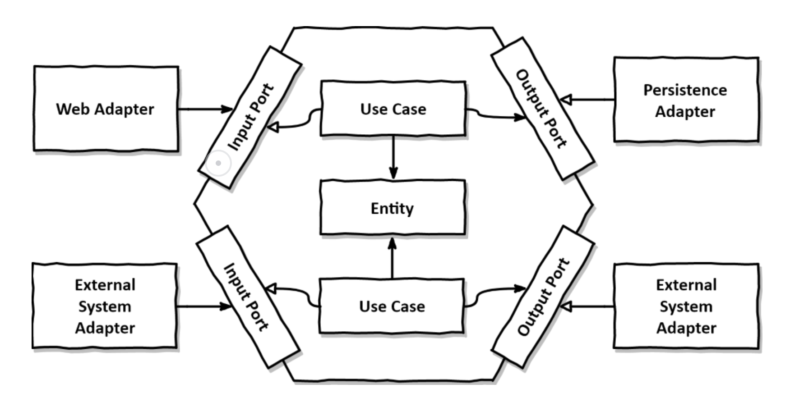
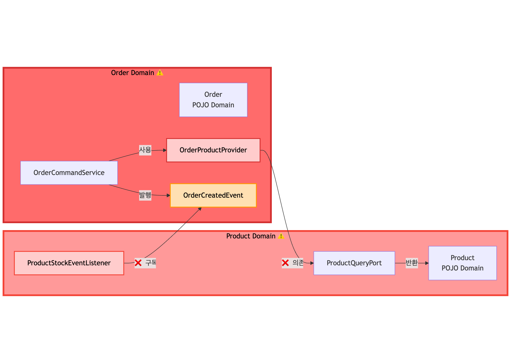

# PlayGround Project (V1.5: Hexagonal Architecture)

## V1.5 아키텍처: 헥사고날 아키텍처

V1.5는 V1에서 발생했던 Service 간 강한 결합과 Fat JPA Domain 문제를 해결하기 위해 Ports & Adapters 패턴을 기반으로 한 헥사고날 아키텍처를 채택했습니다.



**핵심 원칙:**
- **의존성 방향**: 외부(Adapter) → 내부(Domain)로만 향함
- **Domain 독립성**: Domain은 어떤 레이어에도 의존하지 않음
- **Port/Adapter 분리**: Port(인터페이스)를 통해서만 Domain 접근

## 주요 변경 사항

### 1. POJO 도메인과 JPA 엔티티 분리

도메인 모델(`Order`, `Product`, `User`)을 순수 POJO로 유지하고, JPA 영속성을 위한 엔티티(`OrderJpaEntity`, `ProductJpaEntity`, `UserJpaEntity`)를 별도로 관리합니다.

**효과:**
- 도메인 로직이 프레임워크(JPA, Spring)에 독립적
- 비즈니스 로직 테스트 시 JPA 의존성 불필요
- 영속성 기술 변경 시 도메인 로직 영향 없음

### 2. Port/Adapter 패턴 도입

**In Port (Use Case):**
- 비즈니스 유스케이스를 정의하는 인터페이스
- 예: `OrderCommandUseCase`, `ProductUseCase`

**Out Port:**
- 외부 의존성(DB, 이벤트 등)을 추상화하는 인터페이스
- 예: `OrderCommandPort`, `OrderQueryPort`, `OrderEventPort`

**Adapter:**
- Port의 실제 구현체
- Persistence Adapter: DB 접근 구현
- Presentation Adapter: HTTP 요청 처리

**효과:**
- 애플리케이션 코어와 인프라의 완전한 분리
- 의존성 역전 원칙(DIP) 적용
- 테스트 시 Adapter만 Mock 처리

## 현재 아키텍처의 문제점

V1의 문제는 해결했지만, V1.5는 여전히 **단일 모듈** 구조이기 때문에 새로운 문제가 존재합니다.

### 도메인 간 순환 의존성



### 1. 도메인 간 순환 참조 가능성

```kotlin
// Order 도메인 → Product 도메인
class OrderProductProvider(
    private val productQueryPort: ProductQueryPort  // Product 도메인 Port
) {
    fun getProductInfo(productId: Long): ProductInfo {
        // Product 도메인에 의존
    }
}

// Product 도메인 → Order 도메인 (이벤트)
@Component
class ProductStockEventListener {
    @EventListener
    fun handle(orderCreatedEvent: OrderCreatedEvent) {
        // Order 도메인 이벤트 구독
    }
}
```

**문제:**
- 단일 모듈 내에서 도메인 간 양방향 의존 발생 가능
- 컴파일 타임에 순환 참조 방지 불가능
- 패키지 구조만으로는 경계 강제 어려움

### 2. 도메인 경계가 관례에 의존

```
com.playground
├── user/
│   ├── domain/
│   ├── application/
│   └── persistence/
├── product/
│   ├── domain/
│   ├── application/
│   └── persistence/
└── order/
    ├── domain/
    ├── application/
    └── persistence/
```

**문제:**
- 패키지 네이밍 관례로만 경계 구분
- Order가 Product의 내부 구현(ProductService)에 직접 접근 가능
- 실수로 잘못된 의존성 추가해도 컴파일 성공

### 3. 도메인 확장 시 복잡도 증가

**현재 3개 도메인:**
- User ← Order
- Product ← Order
- Product ↔ Order (이벤트)

**도메인이 추가되면 (Delivery, Payment 등):**
- n개 도메인 간 n(n-1)/2 개의 잠재적 의존성
- 관리 복잡도 기하급수적 증가

## 향후 계획 (V2: Multi-Module Architecture)

V1.5에서 다져진 헥사고날 아키텍처 기반 위에, 다음 버전(V2)에서는 **멀티 모듈 아키텍처**로의 전환을 통해 위에서 식별한 문제들을 해결할 예정입니다.

**V1.5의 근본적인 한계:**
- 단일 모듈 구조로 인해 도메인 간 순환 참조를 컴파일 타임에 방지할 수 없음
- 패키지 네이밍 관례만으로는 도메인 경계를 강제하기 어려움
- 도메인이 추가될수록 잠재적 의존성이 기하급수적으로 증가

**V2의 접근:**
- 각 도메인을 독립적인 모듈로 분리하여 물리적 경계 확립
- 빌드 시스템을 활용한 의존성 관리로 관례가 아닌 **컴파일 타임 강제**
- 모듈 간 명확한 인터페이스 정의를 통한 느슨한 결합

**→ [V2.0: Multi Module Hexagonal Architecture로 이동](./README-V2.0.md)**