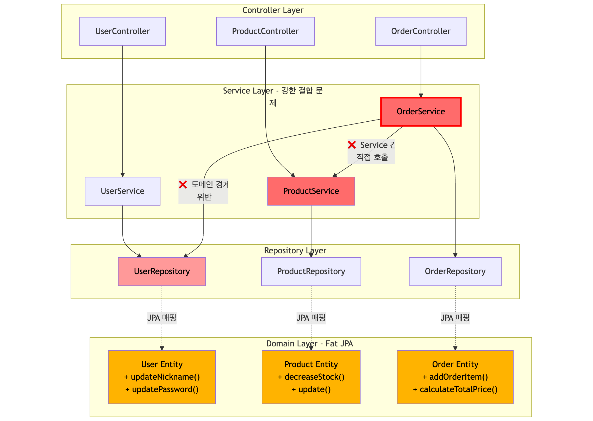

# PlayGround Project (V1: Layered Monolith)

## V1 아키텍처: 계층형 모놀리식 (Layered Monolith)

V1은 빠른 기능 개발과 초기 생산성을 우선시하는 단계에서 널리 채택되는 전통적인 계층형 아키텍처를 따릅니다.

```
+---------------------+
|   Controller Layer  |  (Web)
+---------------------+
          |
          v
+---------------------+
|    Service Layer    |  (Business Logic)
+---------------------+
          |
          v
+---------------------+
|   Repository Layer  |  (Persistence)
+---------------------+
          |
          v
+---------------------+
|    Domain Layer     |  (JPA Entities)
+---------------------+
```

- **Controller Layer:** 클라이언트의 요청을 받아 Service Layer로 전달하고 응답을 반환합니다. 인증/인가 처리 및 요청 DTO 유효성 검증을 담당합니다.
- **Service Layer:** 비즈니스 로직을 처리하고 트랜잭션을 관리합니다. 여러 Repository를 조합하여 상위 수준의 비즈니스 흐름을 정의합니다.
- **Repository Layer:** 데이터베이스 접근을 담당하며, Spring Data JPA를 활용합니다.
- **Domain Layer:** 핵심 비즈니스 엔티티(JPA Entity)와 그 엔티티가 가지는 비즈니스 로직을 포함합니다.

**특징:**
- JPA Entity가 도메인 엔티티의 역할을 겸하고 있습니다. (Fat JPA Domain의 가능성)
- Service Layer가 다른 Service Layer의 메소드를 직접 호출하여 비즈니스 로직을 오케스트레이션합니다. (강한 결합의 가능성)

## 🚨 현재 아키텍처의 문제점

V1 아키텍처는 의도적으로 다음과 같은 문제점을 포함하고 있습니다. 이러한 문제들은 V1.5에서 Hexagonal Architecture로 전환하면서 해결될 예정입니다.

### 실제 의존성 구조



### 1️⃣ Service Layer 강한 결합

```kotlin
// OrderService.kt
class OrderService(
    private val productService: ProductService,  // ❌ 다른 Service 직접 의존
    private val userRepository: UserRepository,   // ❌ 다른 도메인 Repository 직접 접근
    private val orderRepository: OrderRepository
) {
    fun createOrder(...) {
        val user = userRepository.findByLoginId(...)  // 도메인 경계 위반

        orderItems.forEach {
            productService.decreaseStock(...)  // Service → Service 강한 결합
        }
    }
}
```

**문제:**
- OrderService가 ProductService에 강하게 결합
- OrderService(주문)가 UserRepository(사용자)에 직접 의존 (도메인 경계 위반)
- 테스트 시 다른 도메인의 인프라까지 Mock해야 함
- 모듈 분리 시 순환 참조 가능성

### 2️⃣ Fat JPA Domain

```kotlin
// Product.kt
@Entity  // ❌ JPA 기술과 도메인 로직이 혼재
class Product(...) : BaseEntity() {
    var stock: Int  // JPA 필드

    // 비즈니스 로직이 Entity에 포함
    fun decreaseStock(quantity: Int) {
        if (stock - quantity < 0) throw InsufficientStockException(...)
        stock -= quantity
    }
}
```

**문제:**
- JPA Entity가 도메인 로직을 포함 (기술과 도메인 혼재)
- 영속성 기술(JPA) 변경 시 도메인 로직도 영향
- 테스트 시 JPA 의존성 필요
- 도메인 순수성 상실

## 향후 계획 (V1.5: Hexagonal Architecture 전환)

위에서 식별한 문제들을 해결하기 위해, V1.5에서는 **Hexagonal Architecture (Ports & Adapters) 및 Clean Architecture** 원칙을 적용하여 애플리케이션의 내부 구조를 재설계할 예정입니다.

**주요 개선 사항:**

1. **Port/Adapter 패턴 도입**
   - Service 간 직접 호출 대신 Port를 통한 느슨한 결합
   - 도메인 경계를 넘는 의존성을 인터페이스로 추상화

2. **순수 도메인 모델 구성**
   - JPA Entity와 Domain Model 완전 분리
   - 프레임워크 독립적인 비즈니스 로직

3. **명확한 의존성 방향**
   - Application Layer → Domain Layer ← Infrastructure Layer
   - 의존성 역전 원칙(DIP) 적용

이를 통해 더욱 유연하고 유지보수하기 쉬운 아키텍처로 진화할 것입니다.

**→ [V1.5: Hexagonal Architecture로 이동](./README-V1.5.md)**
