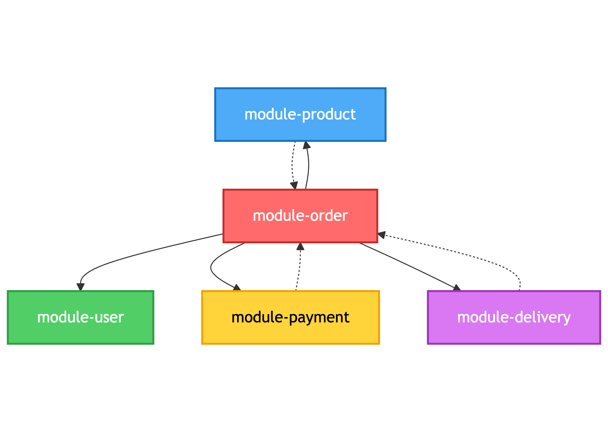
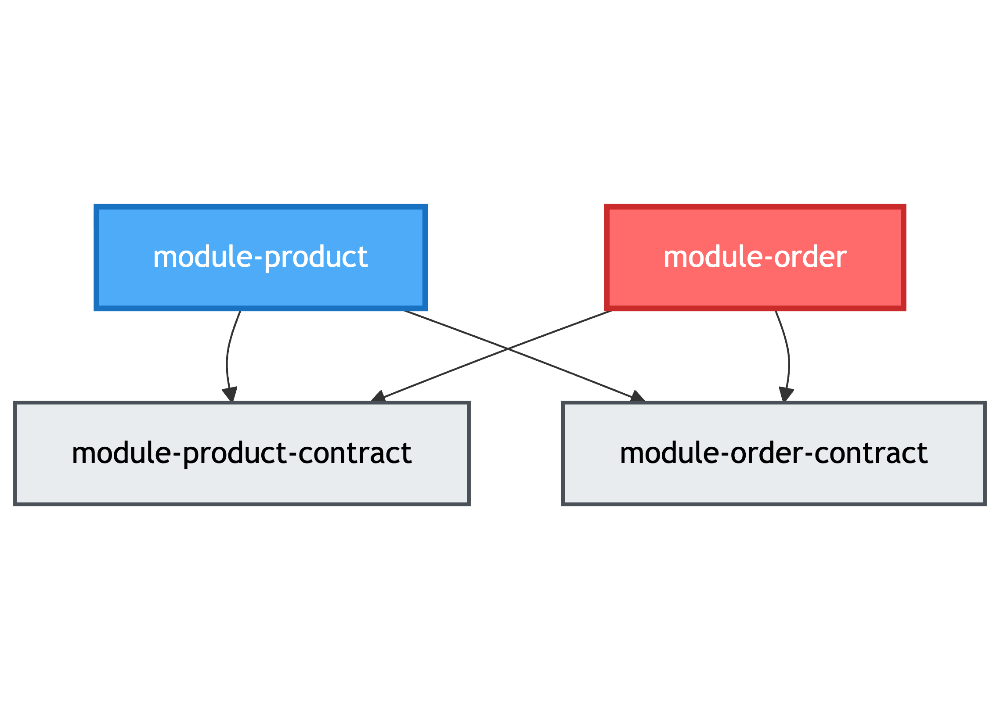

# PlayGround Project (V2.0: Multi-Module Hexagonal Architecture)

## V2.0 아키텍처: 멀티 모듈 헥사고날 아키텍처

V2.0은 V1.5에서 발생했던 단일 모듈의 한계(도메인 간 순환 참조, 관례 기반 경계)를 해결하기 위해 각 도메인을 독립적인 Gradle 모듈로 분리하고, 빌드 시스템을 통해 컴파일 타임에 의존성 방향을 강제하는 멀티 모듈 아키텍처를 채택했습니다.

**핵심 원칙:**
- **물리적 모듈 분리**: 각 도메인을 독립적인 Gradle 모듈로 구성
- **Contract Module**: 도메인 간 협력을 위한 최소한의 인터페이스만 노출
- **컴파일 타임 강제**: 순환 참조 및 잘못된 의존성은 빌드 실패로 차단

## 모듈 구조

V2.0은 각 도메인을 독립적인 Gradle 모듈로 구성합니다.

**도메인 모듈:**
- `module-order` / `module-order-contract`
- `module-product` / `module-product-contract`
- `module-user` / `module-user-contract`
- `module-payment` / `module-payment-contract`
- `module-delivery` / `module-delivery-contract`
- `module-auth` / `module-auth-contract`

각 도메인 모듈은 V1.5에서 정립한 헥사고날 아키텍처 구조를 그대로 유지합니다.

```
module-order/
├── domain/          (순수 도메인 모델)
├── application/     (port, service)
├── persistence/     (adapter 구현체)
└── presentation/    (adapter 구현체)
```

멀티 모듈 전환의 목적은 아키텍처 스타일 변경이 아니라 **경계의 고정**입니다.

## 주요 변경 사항

V2.0은 한 번에 완성된 것이 아니라, 3단계에 걸쳐 점진적으로 진화했습니다.

### 1. 레이어별 단위테스트 전환

V1.5에서는 통합테스트 중심으로 테스트를 작성했습니다.

```kotlin
// V1.5: 통합테스트
@SpringBootTest  // 전체 Spring Context 로드
class OrderCreateApiTest(
    @Autowired private val productRepository: ProductRepository,  // 실제 DB
) : ApiTest() {
    @Test
    fun `주문 생성 - 성공`() {
        val user = createUser(...)           // 실제 DB에 User 저장
        val product = productRepository.save(...)  // 실제 DB에 Product 저장
        val jwtToken = getAccessToken(...)   // 실제 JWT 발급
        // Controller → Service → Repository → DB 전체 플로우 테스트
    }
}
```

**문제점:**
- 테스트가 변경에 너무 취약함
- Product 엔티티가 변경되면 Order Controller 테스트도 깨짐
- 한 레이어의 변경이 다른 레이어 테스트에 연쇄적으로 영향
- 전체 Spring Context 로딩으로 인한 느린 테스트 실행 속도

V2.0에서는 각 레이어를 격리하여 단위테스트로 전환했습니다.

```kotlin
// V2.0: 단위테스트
class OrderCommandServiceTest {  // Spring 없음
    private val orderQueryPort: OrderQueryPort = mock()  // Mock 의존성
    private val orderCommandPort: OrderCommandPort = mock()

    private val orderCommandService = OrderCommandService(
        orderQueryPort, orderCommandPort, ...
    )

    @Test
    fun `주문 생성 Command 수신 시 주문 Aggregate가 생성되고 Event가 발행되어야 한다`() {
        // 순수 비즈니스 로직만 테스트 (DB 없음)
    }
}
```

**효과:**
- Controller는 Controller만, Service는 Service만, Adapter는 Adapter만 테스트
- 의존성은 Mock으로 격리하여 변경 영향 최소화
- Service 레이어는 Spring 없이 순수 객체로 테스트 (빠른 실행)
- 단일 책임만 검증하여 테스트 의도 명확화

### 2. 독립 모듈 분리

각 도메인을 독립적인 Gradle 모듈로 분리하여 물리적 경계를 확립합니다.

그러나 Contract 모듈 도입 전, 단순히 모듈만 분리했을 때는 **순환 참조 문제**가 발생했습니다.



**문제 발생:**
```
> Could not resolve all dependencies for configuration ':module-product:implementation'.
   > Circular dependency between the following tasks:
     :module-order:compileKotlin
     :module-product:compileKotlin
```

- Order → Product: 상품 정보 조회를 위해 Product 모듈 의존
- Product → Order: `OrderCreatedEvent`를 구독하기 위해 Order 모듈 의존
- **Gradle 빌드 실패**: 순환 참조로 인해 컴파일 불가능

```kotlin
// module-order/build.gradle.kts
dependencies {
    implementation(project(":module-product"))  // ❌ Product에 직접 의존
    implementation(project(":module-user"))
}

// module-product/build.gradle.kts
dependencies {
    implementation(project(":module-order"))    // ❌ Order에 직접 의존 (이벤트 구독)
}
// → Circular dependency 에러 발생!
```

### 3. Contract Module 도입

위에서 발생한 순환 참조 문제를 해결하기 위해 **Contract Module**을 도입합니다.

도메인 간 협력을 위한 최소한의 인터페이스만 노출하는 경량 모듈입니다.

```
module-order-contract/
├── domain/
│   ├── event/
│   │   └── OrderCreatedEvent.kt        // 이벤트
│   └── OrderInfo.kt                     // 도메인 DTO
└── OrderProvider.kt                     // 공개 인터페이스
```

**Contract Module의 역할:**
- 외부 도메인에 제공되는 최소한의 인터페이스 정의 (Provider, Event)
- 도메인 간 통신을 위한 DTO/Command/Query 모델 제공
- 도메인 내부 구현(Service, Repository) 노출 차단
- **비즈니스 로직을 포함하지 않음** (순수 경계 역할)

**순환 참조 해결:**
```kotlin
// Before: 순환 참조 발생
// module-order → module-product
// module-product → module-order (❌ Circular dependency!)

// After: Contract를 통한 단방향 의존
// module-order → module-product-contract ✅
// module-product → module-order-contract ✅
```

```kotlin
// module-order/build.gradle.kts
dependencies {
    implementation(project(":module-product-contract"))  // ✅ Contract만 의존
    implementation(project(":module-user-contract"))
    // implementation(project(":module-product"))        // ❌ 내부 구현 접근 불가
}

// module-product/build.gradle.kts
dependencies {
    implementation(project(":module-order-contract"))   // ✅ 이벤트 구독용 Contract
    // implementation(project(":module-order"))          // ❌ 직접 의존 불가
}
```



**효과:**
- 도메인 간 의존성 방향을 단방향으로 유지
- 순환 참조 발생 시 컴파일 타임에 차단
- 도메인 내부 구현과 외부 인터페이스(Contract) 분리로 변경 영향 최소화
- 도메인 경계가 코드 레벨에서 명확히 가시화
- **MSA 전환 시 즉시 활용 가능**: Contract Module의 인터페이스와 이벤트가 그대로 API Spec/Event Spec으로 전환

**Trade-offs:**

멀티 모듈 구조와 Contract Module은 다음과 같은 비용을 동반합니다.

- **모듈 수 증가**: 각 도메인마다 Contract 모듈이 필요해 전체 모듈 수가 2배로 증가
- **의존성 관리 복잡도**: 각 모듈의 build.gradle.kts에서 Contract 의존성을 명시적으로 관리해야 함
- **Contract 변경 비용**: 도메인 간 인터페이스(Provider, Event, DTO) 변경 시 Contract 모듈 수정 + 의존하는 모든 도메인 수정 필요
- **초기 개발 속도 저하**: 새로운 기능 추가 시 Contract 정의 → 구현 순서로 진행해야 하며, 단일 모듈 대비 컨텍스트 스위칭 증가

V2.0은 이러한 비용을 감수하더라도, 도메인 경계가 흐려지는 시점을 늦추고 장기적인 유지보수성을 확보하는 선택을 했습니다.

## 현재 프로젝트의 문제점

V2.0은 구조적으로 안정된 모놀리스를 만드는 데 성공했습니다. 도메인 경계가 명확하고, 컴파일 타임에 의존성이 강제되며, 확장 시에도 순환 참조 걱정이 없습니다.

**그러나 실제 운영 환경에서는 구조보다 성능, 동시성, 관측성이 더 큰 문제가 됩니다.**

### 1. 성능 병목 미확인

현재 아키텍처는 기능 중심으로 설계되었으며, 실제 트래픽 하에서의 성능 특성을 측정하지 않았습니다.

**문제:**
- 어느 지점이 병목인지 데이터 없음
- 동시 요청 증가 시 어떤 리소스가 부족한지 불명확
- 최적화 우선순위를 판단할 근거 부족

### 2. 동시성 처리 전략 부재

멀티 모듈 구조는 코드 경계를 명확히 했지만, 동시 요청에 대한 처리 전략은 프레임워크에 의존하고 있습니다.

**문제:**
- 재고 감소 같은 동시성 민감 작업의 정합성 보장 방법 불명확
- Connection Pool, Thread Pool 같은 리소스 한계 미경험
- 분산 환경을 고려한 Lock 전략 부재

### 3. 측정 및 관측성 부족

구조는 잘 잡혀있지만, 시스템이 어떻게 동작하는지 측정할 수단이 없습니다.

**문제:**
- 응답 시간, 처리량 같은 핵심 메트릭 부재
- 병목 지점 식별을 위한 프로파일링 도구 미적용
- Before/After 비교를 위한 성능 측정 기준 없음

## 향후 계획 (V2.5: High Performed Monolith)

V2.0에서 다져진 안정된 구조 위에서, V2.5에서는 **의도적으로 병목을 만들고, 측정하고, 개선하는** 과정을 통해 운영 관점의 문제를 다룰 예정입니다.

**V2.5의 접근:**
- 부하 테스트를 통한 병목 지점 식별
- 재고 관리 같은 동시성 민감 영역의 성능 개선
- 메트릭 수집 및 모니터링 시스템 구축
- 개선 전후 성능을 데이터로 증명

이를 통해 "구조적으로 안정된" 모놀리스에서 "고성능" 모놀리스로 진화하며, 동시에 모놀리스의 근본적인 한계(리소스 격리, 독립 확장)를 확인하여 V3.0 MSA 전환의 명분을 확보할 것입니다.

**→ [V2.5: High Performed Monolith로 이동](./README-V2.5.md)**