# PlayGround Project (V2.5: High Performed Monolith)

## V2.5 아키텍처: 고성능 모놀리스

V2.5는 V2.0에서 다져진 안정된 멀티 모듈 구조 위에서, **실제 트래픽 환경에서의 성능 병목을 식별하고 개선**하는 단계입니다.

구조적 안정성을 넘어, 측정 → 개선 → 검증의 과학적 방법론을 통해 고성능 모놀리스를 구축하고, 동시에 **모놀리스의 근본적 한계**를 데이터로 증명하여 MSA 전환의 명분을 확보합니다.

**핵심 원칙:**
- **가설 → 실험 → 측정 → 결론**: 모든 개선을 데이터로 뒷받침
- **실패 포함**: 분산 락 실험 → 성능 악화 → 대안 선택 등 시행착오 기록
- **성능 측정**: Before/After를 수치와 그래프로 증명
- **한계 인정**: 모놀리스로 해결 불가능한 문제 명확히 식별

## 주요 변경 사항

V2.5는 4개의 Phase를 거쳐 점진적으로 진화했습니다.

### Phase 1: 성능 병목 식별 및 문제 인식

#### 1-1. 부하 테스트 환경 구축

- k6 부하 테스트 도구 도입
- Grafana + Prometheus 메트릭 수집
- Loki 로그 집계

#### 1-2. 초기 성능 측정 및 가설 수립

**문제 인식:**

동기식으로 결제 로직(Payment → Order → Product → Delivery)을 실행했을 때, vu1과 vu5의 응답 속도가 약 5배 차이 발생.

**가설:**

결제 로직에 심각한 병목이 존재한다.

**측정 결과:**

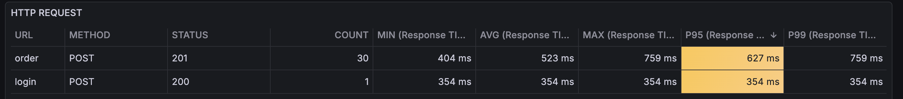
*결제 로직 포함 (vu1): P95 627ms*

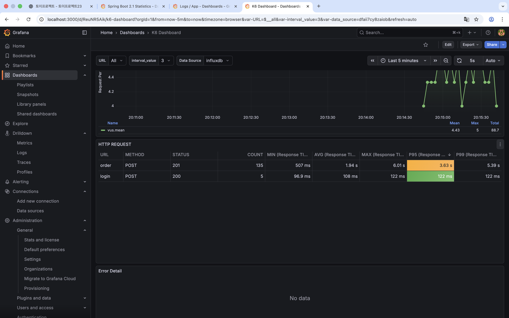
*결제 로직 포함 (vu5): P95 3.63초*

| VU | RPS | P95 | P99 | 배수 |
|----|-----|-----|-----|------|
| 1  | 1   | 627ms | 759ms | 1x |
| 5  | 5   | **3.63s** | **5.39s** | **5.8x** |

**분석:**
- vu5에서 P95가 3.63초 (vu1 대비 약 5.8배)
- 단순히 요청이 5배 증가했는데, 응답 시간도 5배 이상 증가
- 동기 처리로 인한 누적 지연 의심

**결론:**

결제 로직 제거 후 재측정하여 가설 검증 필요.

#### 1-3. 가설 검증 (결제 로직 제거)

**실험:**

Event consumer를 비활성화하여 결제 로직(Payment → Order → Product → Delivery) 제거 후 재측정.

**측정 결과:**

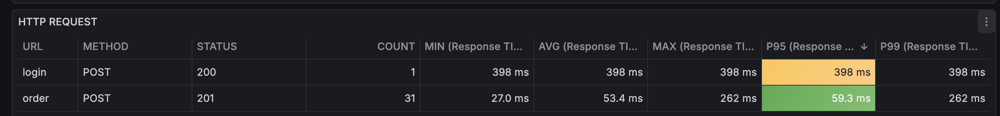
*결제 로직 제외 (vu1): P95 59.3ms*

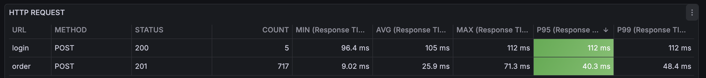
*결제 로직 제외 (vu5): P95 40.3ms*

| 상태 | RPS | P95 | P99 | 개선율 |
|------|-----|-----|-----|--------|
| 결제 **동작** | 5 | 3.63s | 5.39s | - |
| 결제 **미동작** | 5 | **40.3ms** | **48.4ms** | **98.9%** |

**결론:**

✅ **가설이 맞았다!** 결제 로직 제거 시 P95가 3.63초 → 40.3ms로 **90배 개선**.

동기식 결제 로직이 주요 병목임을 데이터로 증명.

#### 1-4. 재고 차감 로직의 성능 한계 탐색

**새로운 질문:**

결제 로직 없이 재고 차감만으로 얼마나 확장 가능한가?

**실험:**

재고 차감만 남긴 상태에서 RPS를 점진적으로 증가시키며 병목 지점 탐색.

**측정 결과:**

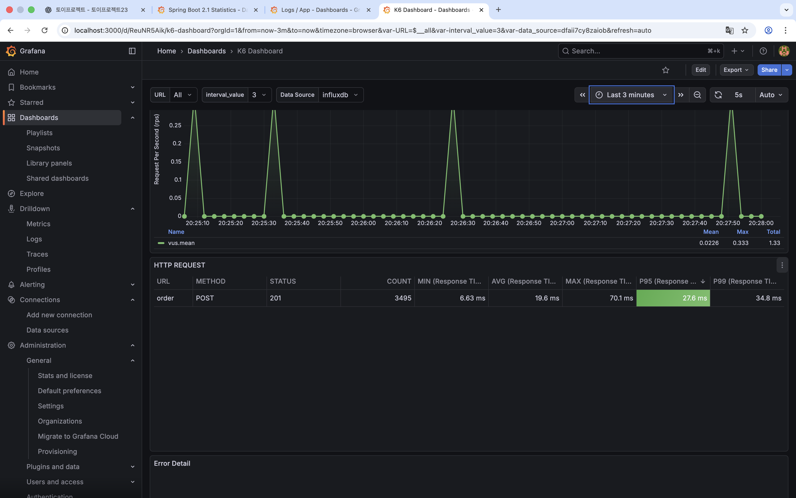
*RPS 20: P95 27.6ms (정상)*

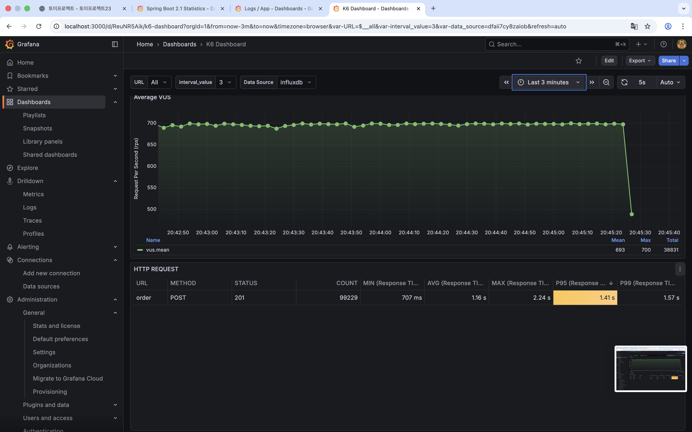
*RPS 700: P95 1.41초 (병목 발생)*

| RPS | P95 | P99 | 상태 |
|-----|-----|-----|------|
| 20  | 27.6ms | 34.8ms | ✅ 정상 |
| 700 | **1.41s** | **1.57s** | ⚠️ 병목 |

**Connection Pool 분석 (RPS 700):**

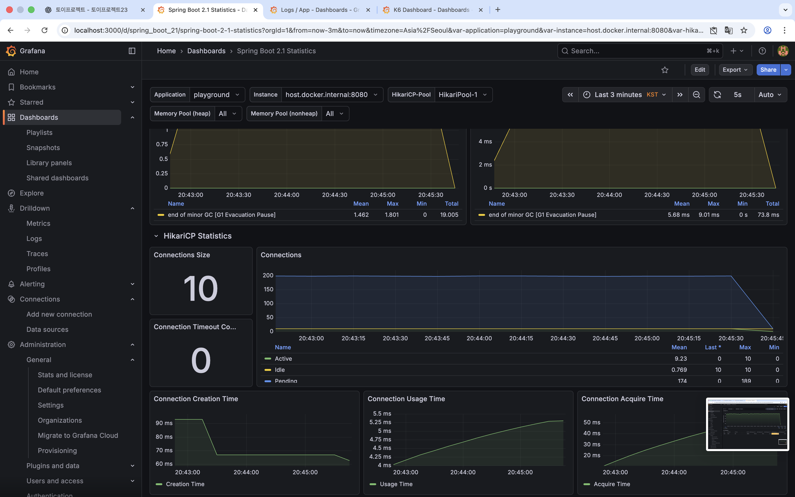

**HikariCP 상태:**
- Pool Size: 10
- Active: 평균 9.23, 최대 10 (거의 100% 사용)
- **Pending: 평균 174, 최대 189** 🚨

**결론:**

RPS 700에서 새로운 병목 발견:
- Connection Pool 부족 (Pending 대기 평균 174개)
- 재고 차감 로직 자체에도 최적화 필요

**개선 방향:**
1. 재고 관리를 Redis로 이관 (Disk I/O 감소)

### Phase 2: Redis 재고 관리

#### 2-1. Redis 도입 배경

**첫 번째 시도: Connection Pool 증가**

RPS 700에서 Connection Pool Pending이 평균 174개 발생 → Pool Size를 10에서 50으로 증가 시도.

**결과:**
- Pending은 줄었지만 근본적 해결 안 됨
- PostgreSQL max_connections 한계 존재
- 단순히 Connection을 늘리는 것은 임시방편

**고민:**

재고라는 데이터가 굳이 **실시간으로 DB에 반영**될 필요가 있을까?

**핵심 인사이트:**

주문이 들어올 때마다 PostgreSQL에 UPDATE 쿼리를 날리는 것이 병목.
→ Disk I/O가 누적되어 Connection 점유 시간 증가
→ Connection Pool Pending 발생

**해결 아이디어:**

주기적으로 DB에 반영해서 Disk I/O를 줄이자.
- 실시간 반영 대신 **배치 동기화** (예: 10초마다)
- Disk I/O 횟수 감소 → Connection 점유 시간 감소

**새로운 문제:**

그 사이에 어딘가에선 **실시간으로 재고를 계산**해야 함.
- 주문 요청 시 재고가 있는지 즉시 확인 필요
- DB는 10초마다 동기화 → 실시간 조회 불가능

**최종 해결책:**

메모리에 재고를 캐싱하는 **Redis** 도입.
- In-Memory 저장소로 Disk I/O 완전 제거
- 실시간 재고 조회/차감 (INCR, DECR 연산)
- 주기적으로 PostgreSQL과 동기화 (배치)

**Redis 선택 이유:**
- In-Memory 저장소 → Disk I/O 없음
- 원자적 연산 지원 (INCR, DECR) → 동시성 안전
- Lua Script로 복잡한 재고 로직 구현 가능

#### 2-2. 아키텍처 설계

- `StockCachePort` (Port/Adapter 패턴 유지)
- `RedisStockClient` (Redis 구현체)
- Lua Script 기반 원자성 보장

#### 2-3. 분산 락 실험 (실패)

- Redis 분산 락 적용
- 성능 측정 결과: 11% 악화
- 원인 분석: 단일 인스턴스에서 네트워크 오버헤드
- 결론: Lua Script만으로 충분

#### 2-4. 3단계 재고 관리 시스템

- `available`: 초기 재고 (고정값, 기준점)
- `reserved`: 결제 대기 중 (일시적, 유동적)
- `confirmed`: 판매 완료 (확정, DB 동기화 대상)
- 판매 가능 재고 = available - reserved - confirmed

#### 2-5. DB 동기화 전략

- Scheduler 기반 배치 동기화 (10초 주기)
- MSET vs executePipelined 비교
- PAGE_SIZE 최적화 (1천 vs 1만 vs 10만)

#### 2-6. 성능 개선 결과

**Before (Phase 1: PostgreSQL 재고 관리, RPS 100):**


- Pool Size: 10
- Pending: 평균 174, 최대 189

**After (Redis 재고 관리, RPS 100):**

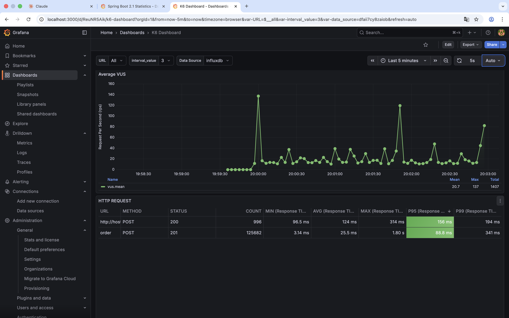

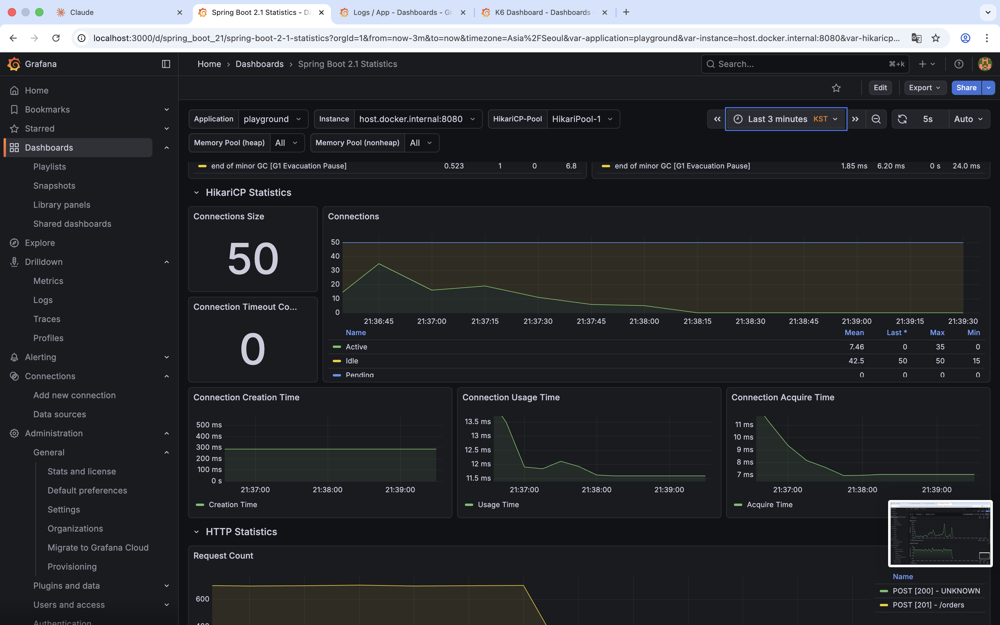
- Pool Size: 50
- Pending: **0** (완전 해소)

**성능 개선 (RPS 100 기준):**

| 항목 | Before | After | 개선율 |
|------|--------|-------|--------|
| **P95** | 1.41s | **88.8ms** | **93.7% ↓** (약 16배) |
| **P99** | 1.57s | **341ms** | **78.3% ↓** (약 5배) |
| **Connection Pool Pending** | 평균 174 | **0** | **완전 해소** |
| **Active Connections** | 평균 9.23 (거의 100%) | 평균 7.46 (15%) | 85% 감소 |

**핵심 성과:**
- Disk I/O 제거로 Connection 점유 시간 대폭 감소
- Pending 대기 완전 해소 (174 → 0)
- P95 응답 시간 93.7% 개선 (1.41s → 88.8ms)
- Connection Pool 여유 확보 (Active 15% 수준)

### Phase 3: 비동기 이벤트 처리

#### 3-1. 동기 처리의 문제

**현재 구조 (Phase 2 완료 후):**

주문 생성 시 Payment → Order → Product → Delivery가 **동기식**으로 실행.

**측정 결과 (RPS 100):**

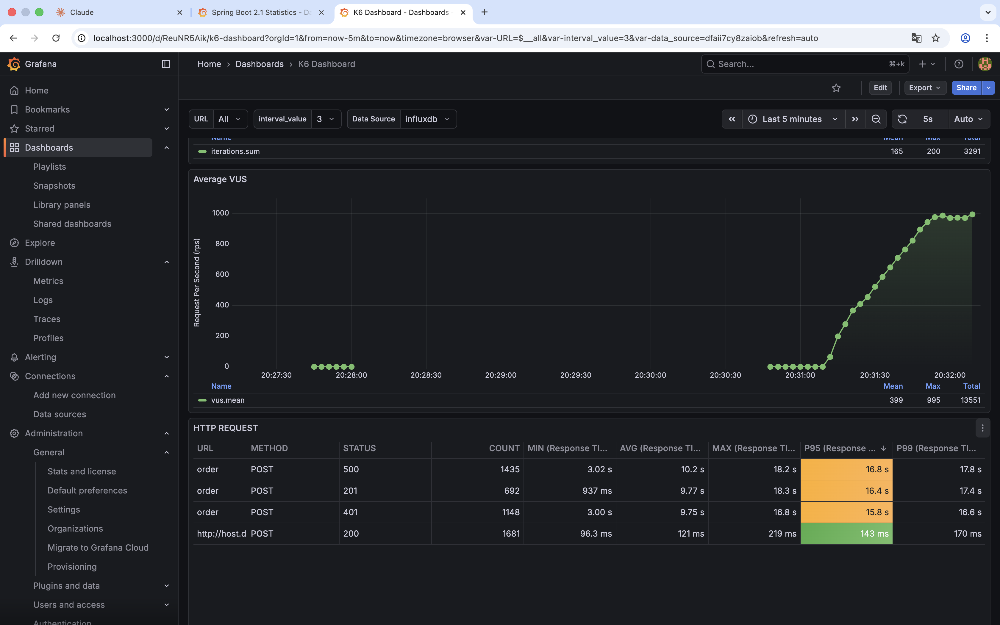

- **P95**: 16.4s
- **P99**: 17.4s

**문제 분석:**
- 응답 시간 = 주문 생성 + 결제 + 재고 + 배송 (모두 합산)
- 한 단계라도 지연되면 전체 응답 시간 증가
- 사용자는 불필요하게 오래 기다림 (주문 생성만 확인하면 되는데)

#### 3-2. 첫 번째 시도: 동기식 AFTER_COMMIT

**가설:**

`@TransactionalEventListener(phase = AFTER_COMMIT)`을 사용하면:
- 트랜잭션 커밋 후 Connection이 반환됨
- 다음 이벤트가 새로운 Connection을 얻어 처리됨
- 응답 시간 감소 예상

**구현:**
```kotlin
@TransactionalEventListener(phase = TransactionPhase.AFTER_COMMIT)
fun handleOrderCreated(event: OrderCreatedEvent) {
    // 결제, 재고, 배송 처리
}
```

**측정 결과:**

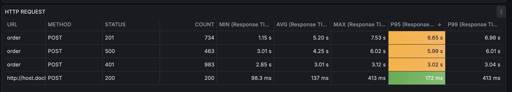

- **P95**: 6.65s
- **P99**: 6.98s

| 상태 | P95 | P99 | 개선율 |
|------|-----|-----|--------|
| Before | 16.4s | 17.4s | - |
| AFTER_COMMIT | 6.65s | 6.98s | 59% ↓ |

**결론:**

❌ **가설이 틀렸다!**

- Connection은 빨리 반환되지만, **HTTP 응답은 여전히 대기**
- `AFTER_COMMIT`은 트랜잭션 커밋 후 실행하지만, **여전히 동기적으로 실행됨** (같은 스레드)
- 응답 시간 = 주문 + 결제 + 재고 + 배송 (여전히 합산)
- 6.65초는 여전히 너무 느림

**깨달음:**

트랜잭션 경계와 스레드 실행은 별개다.
- `AFTER_COMMIT`: 트랜잭션 커밋 후 실행 (Connection 반환)
- **하지만 같은 스레드**에서 실행 → HTTP 응답 대기

#### 3-3. 두 번째 시도: 비동기식 AFTER_COMMIT

**새로운 가설:**

`@Async`를 추가하면:
- 이벤트 리스너가 **별도 스레드**에서 실행
- 주문 생성 완료 후 즉시 HTTP 응답 반환
- 결제, 재고, 배송은 백그라운드 처리

**구현:**
```kotlin
@Async
@TransactionalEventListener(phase = TransactionPhase.AFTER_COMMIT)
fun handleOrderCreated(event: OrderCreatedEvent) {
    // 별도 스레드에서 결제, 재고, 배송 처리
}
```

**측정 결과:**

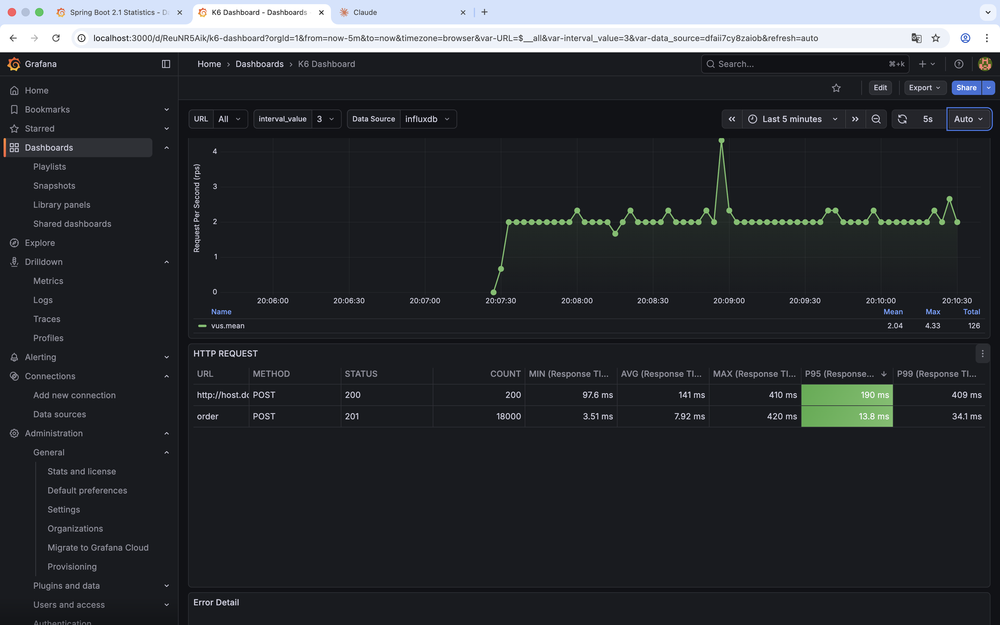

- **P95**: 13.8ms
- **P99**: 34.1ms

#### 3-4. 성능 개선 결과

**전체 비교:**

| 단계 | P95 | P99 | 개선율 |
|------|-----|-----|--------|
| **Before** (동기식) | 16.4s | 17.4s | - |
| **동기 AFTER_COMMIT** | 6.65s | 6.98s | 59% ↓ |
| **비동기 AFTER_COMMIT** | **13.8ms** | **34.1ms** | **99.8% ↓** |

**핵심 성과:**
- ✅ P95 응답 시간 **99.8% 개선** (16.4s → 13.8ms)
- ✅ P99 응답 시간 **99.8% 개선** (17.4s → 34.1ms)
- ✅ RPS 100 완벽 대응
- ✅ 사용자는 주문 생성만 기다림 (결제, 재고, 배송은 백그라운드)

**트랜잭션 설계:**
- 각 도메인의 트랜잭션 독립 실행
- `AFTER_COMMIT` + `@Async` 조합으로 정합성과 성능 모두 확보

**핵심 교훈:**
- `@TransactionalEventListener(AFTER_COMMIT)`: 트랜잭션 경계 제어
- `@Async`: 스레드 실행 제어
- 두 가지를 함께 사용해야 비동기 처리 완성

### Phase 4: 모놀리스의 한계 확인

#### 4-1. RPS 700 도전

**기대:**

Phase 3까지 완료 후, RPS 100에서 P95 13.8ms를 달성.
→ RPS 700도 충분히 가능할 것으로 예상.

**현실:**

RPS 700 부하 테스트 시작 → **즉시 장애 발생**

#### 4-2. 첫 번째 시도: Connection Pool 50

**측정 결과:**

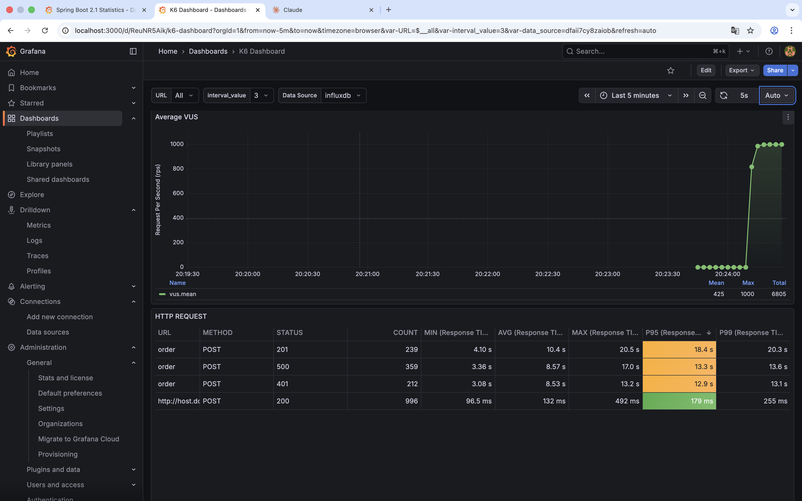

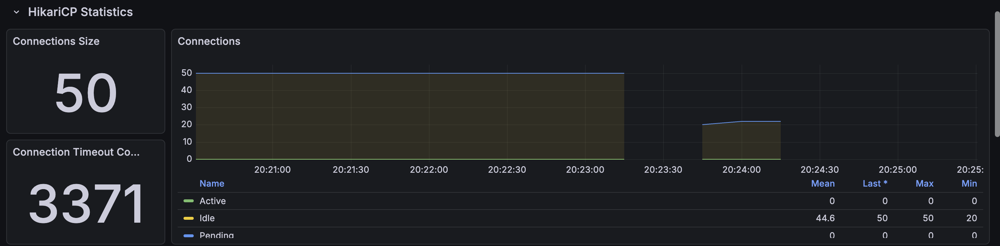

| 항목 | 값 | 상태 |
|------|-----|------|
| **P95** | 18.4s | 🚨 |
| **P99** | 20.3s | 🚨 |
| **Connection Timeout** | **3371개** | 🚨 |
| Pool Size | 50 | |

**문제:**
- Connection Timeout 3371개 발생
- Connection을 얻지 못하고 요청 실패
- P95 18.4초 (RPS 100 대비 1300배 느림)

#### 4-3. 두 번째 시도: Connection Pool 증가

**시도:**

Connection Pool을 더 늘려보자.
- 설정: 50 → 100으로 증가

**측정 결과:**

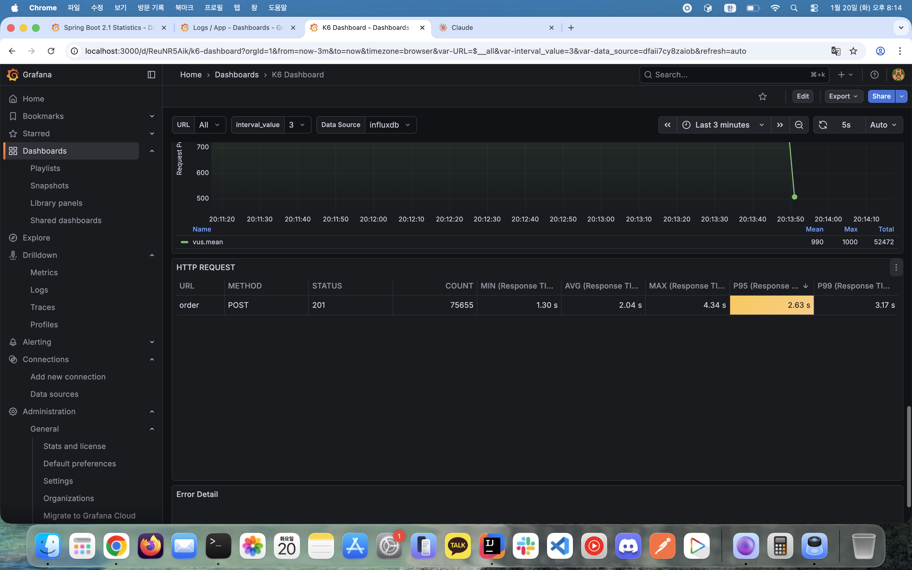

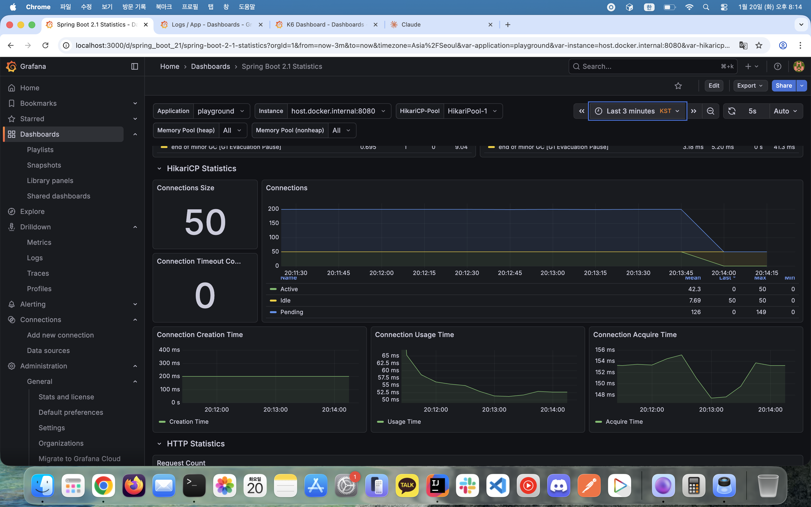

| 항목 | Before (Pool 50) | After (Pool 증가) | 개선 여부 |
|------|-----------------|------------------|----------|
| **P95** | 18.4s | 2.63s | ✅ 개선 |
| **P99** | 20.3s | 3.17s | ✅ 개선 |
| **Timeout** | 3371 | 0 | ✅ 해소 |
| **Pending** | ? | 평균 126, 최대 149 | ❌ 여전히 발생 |
| **Active** | ? | 평균 42.3 (거의 100%) | ⚠️ 포화 |

**결과:**
- Timeout은 해소되었지만, 여전히 **Pending 126개 대기**
- P95 2.63s는 RPS 100 (13.8ms) 대비 **190배 느림**
- Active Connection 거의 100% 사용 (포화 상태)

#### 4-4. 근본 원인: PostgreSQL max_connections 한계

**발견:**

Connection Pool을 아무리 늘려도 **PostgreSQL max_connections** 한계 존재.

**PostgreSQL 기본 설정:**
```
max_connections = 100
```

**문제:**
- Connection Pool을 100으로 늘려도 DB 서버는 100개만 허용
- 여러 인스턴스를 띄워도 **동일한 DB 공유** → 총합 100개 제한
- Scale-up (max_connections 증가)은 임시방편

**근본적 한계:**
```
모놀리스 아키텍처:
- Order, Payment, Product, Delivery → 단일 DB 공유
- Connection Pool 100 = 전체 시스템 공유
- Order 트래픽 폭증 → Payment도 Connection 못 얻음
```

#### 4-5. 모놀리스의 구조적 한계

**1️⃣ 리소스 격리 불가능**

**문제:**
- 모든 모듈이 하나의 Connection Pool 공유
- Order 트래픽이 폭증하면 Payment, Product, Delivery도 영향
- 한 모듈의 문제가 전체 시스템 마비

**시나리오:**
```
RPS 700 도달
  ↓
Order 요청 급증 → Connection Pool 고갈
  ↓
Payment, Product, Delivery도 Connection 못 얻음
  ↓
전체 시스템 장애
```

**2️⃣ 수평 확장 불가능**

**문제:**
- 인스턴스를 여러 개 띄워도 **동일한 DB 공유**
- Connection Pool 100 = DB 서버의 절대적 한계
- Scale-out이 아닌 **Scale-up만 가능** (임시방편)

**시도한 해결책:**
- ❌ Connection Pool 증가 → PostgreSQL max_connections 한계
- ❌ 인스턴스 추가 → 동일 DB 공유로 효과 없음
- ❌ max_connections 증가 → DB 서버 메모리 한계, 성능 저하

**3️⃣ 장애 격리 불가능**

**문제:**
- Product DB에 장애 발생 → Order, Payment, Delivery 모두 영향
- 부분 장애가 **전체 장애로 확산**
- Circuit Breaker로도 해결 불가 (동일 DB)

**4️⃣ 독립 배포 불가능**

**문제:**
- 기능이 많아질수록 배포 복잡도 증가
- Payment 모듈만 배포하고 싶어도 **전체 시스템 재배포**
- 작은 변경에도 전체 시스템 리스크

#### 4-6. MSA 전환 결정

**복합적인 이유로 MSA 전환 결정:**

**1. 성능 한계 (데이터로 증명)**
- RPS 100: P95 13.8ms ✅
- RPS 700: P95 2.63s ❌ (190배 느림)
- Connection Pool 한계 (PostgreSQL max_connections)

**2. 리소스 격리 필요**
- 한 모듈의 트래픽 폭증이 다른 모듈에 영향
- 독립적인 Connection Pool 필요

**3. 수평 확장 필요**
- 인스턴스 추가로 확장 불가능 (동일 DB 공유)
- Scale-up은 임시방편

**4. 장애 격리 필요**
- 특정 기능 장애가 전체 시스템 장애로 확산
- 부분 장애 허용 아키텍처 필요

**5. 독립 배포 필요**
- 기능이 많아질수록 배포 복잡도 증가
- 모듈별 독립 배포로 배포 리스크 감소

**MSA 전환 후 기대 효과:**

```
Before (Monolith):
- Single DB + Connection Pool 100 (공유)
- Order, Payment, Product, Delivery 모듈

After (MSA):
- Order Service: DB + Pool 25
- Payment Service: DB + Pool 25
- Product Service: DB + Pool 25 (Redis 포함)
- Delivery Service: DB + Pool 25

총 Connection 100개 동일, 하지만:
✅ 독립적 관리 (리소스 격리)
✅ 독립적 확장 (Payment만 2배 → Pool 50)
✅ 장애 격리 (Product 장애 → Order 정상)
✅ 독립 배포 (Payment만 배포 가능)
```

**결론:**

High Performed Monolith의 한계를 데이터로 증명.
단일 DB 공유 구조로는 **리소스 격리, 수평 확장, 장애 격리, 독립 배포**가 불가능.

→ **V3.0: Microservices Architecture 전환 필요**

## 🚨 현재 프로젝트의 문제점

V2.5는 모놀리스로서 최선의 성능을 달성했지만 (RPS 100, P95 13.8ms), **RPS 700 환경에서 구조적 한계**를 확인했습니다.

### 1️⃣ 성능 한계 (데이터로 증명)

**측정 결과:**
- RPS 100: P95 13.8ms ✅
- RPS 700: P95 2.63s ❌ (190배 느림)
- Connection Pending 평균 126개 발생

**원인:**
- PostgreSQL max_connections 100 한계
- Connection Pool을 늘려도 DB 서버 절대적 한계 존재
- Scale-up은 임시방편 (근본 해결 불가)

### 2️⃣ 리소스/장애 격리 불가능

**문제:**
- 모든 모듈이 단일 DB 공유
- Order 트래픽 폭증 → Payment, Product, Delivery도 Connection 못 얻음
- Product 장애 → 전체 시스템 장애로 확산

**시도한 해결책:**
- Connection Pool 증가 → max_connections 한계

### 3️⃣ 독립 확장/배포 불가능

**문제:**
- 인스턴스 추가해도 동일 DB 공유 (Scale-out 불가)
- Payment만 배포하고 싶어도 전체 시스템 재배포
- 기능 증가 시 배포 복잡도 기하급수적 증가

**근본 원인:**
- 단일 DB 아키텍처
- 모놀리식 배포 구조

## 향후 계획 (V3.0: Microservices Architecture)

V2.5에서 확인한 모놀리스의 한계를 해결하기 위해, V3.0에서는 **Microservices Architecture**로 전환할 예정입니다.

**V2.5의 근본적 한계:**
- 단일 DB 공유 → 리소스/장애 격리 불가능
- Connection Pool 한계 → 수평 확장 불가능
- 모놀리식 배포 → 독립 배포 불가능

**V3.0의 접근:**
- 각 서비스별 독립 DB 구성 (리소스 격리)
- 서비스별 독립 확장 (Payment만 2배 → Pool 50)
- 독립 배포 가능 (배포 리스크 감소)
- Saga 패턴 기반 분산 트랜잭션 처리
- RPS 700+ 재테스트

이를 통해 모놀리스로 해결할 수 없었던 **리소스 격리, 독립 확장, 장애 격리, 독립 배포** 문제를 해결하고, 진정한 고가용성 시스템으로 진화할 것입니다.
