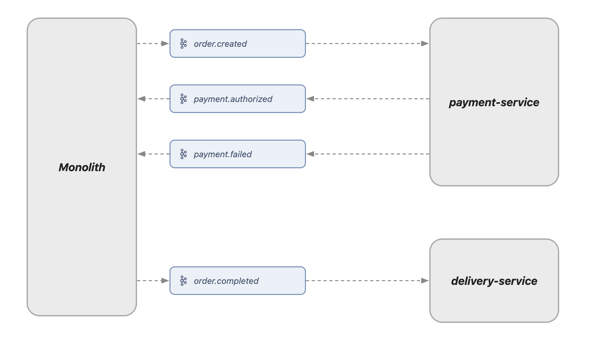
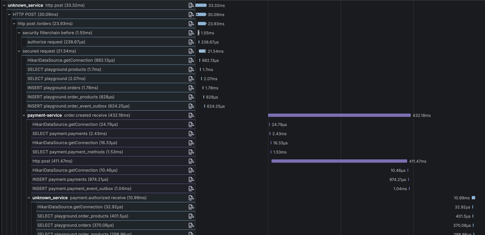

# ArchEvolve (V3.0: Microservices)

## V3.0 아키텍처: 마이크로서비스

V3.0은 V2.5에서 확인한 모놀리스의 한계(단일 DB 공유, 리소스 격리 불가)를 해결하기 위해 서비스를 분리한 단계입니다.

전환은 Strangler Fig 패턴을 채택했습니다. 모놀리스를 한 번에 교체하는 대신, 도메인을 점진적으로 분리하면서 monolith는 나머지 기능을 계속 담당합니다.

서비스 간 이벤트 흐름은 다음과 같습니다.



그런데 MSA 전환 이후 부하 테스트를 진행하던 중, 아키텍처와는 무관하게 **V2.5 시절부터 잠재되어 있던 문제**를 뒤늦게 발견했습니다. MSA 전환 전에도 충분히 해결할 수 있었던 문제였습니다.

### 1. DB 인덱스 부재

80 RPS 부하 테스트 중 부하를 높일수록 DB connection pending이 반복적으로 발생했습니다. 관측 가능한 모든 지표를 확인했지만 원인을 특정할 수 없었습니다. 복잡한 쿼리도 없는데 connection이 고갈되는 상황이 이해되지 않았습니다.

남은 가능성은 쿼리 단위 지연이었습니다. 당시에는 DB 쿼리를 개별적으로 추적할 수단이 없었기 때문에 OTel JDBC 계측을 추가해 Tempo에서 쿼리 단위로 가시화했습니다.

Tempo를 확인하자 단순 조회 쿼리들이 수백ms씩 걸리고 있었습니다. 인덱스가 누락되어 있었습니다.

| 테이블 | 추가된 인덱스 |
|--------|--------------|
| `payments` | `order_id` |
| `order_products` | `order_id` |
| `payment_methods` | `user_id` |

인덱스 3개 추가만으로 P95가 1.03s → 592ms로 **42% 개선**되었고, DB pool pending이 58 → 0으로 해소됐습니다.



---

## 코드 분리가 쉬웠던 이유

MSA 전환에서 가장 어려운 작업 중 하나는 모놀리스에서 서비스 경계를 찾는 일입니다. 어디서 잘라야 할지 모호한 경우가 많습니다. 이 프로젝트에서는 그 작업이 거의 기계적이었습니다.

V2.0에서 도입한 Contract Module이 이미 경계를 명확하게 정의해두었기 때문입니다.

```
module-order-contract/
└── domain/event/
    ├── OrderCreatedEvent.kt    // 다른 서비스에 노출하는 이벤트
    ├── OrderCompletedEvent.kt
    └── OrderFailedEvent.kt

module-delivery-contract/
├── domain/vo/DeliveryInfo.kt
└── application/outbound/DeliveryInfoQueryPort.kt  // 다른 서비스에 노출하는 인터페이스
```

Contract Module은 "다른 도메인에 무엇을 노출할 것인가"를 컴파일 타임에 강제하는 구조였습니다. MSA 전환 시 이 경계가 그대로 서비스 간 계약이 됐습니다.

- `OrderCreatedEvent` → Kafka 토픽 페이로드
- `DeliveryInfoQueryPort` → internal API 엔드포인트

서비스를 분리할 때 "무엇을 외부에 노출해야 하는가"를 새로 고민할 필요가 없었습니다. V2.0에서 이미 정의한 계약을 통신 방식만 바꿔 옮기는 작업이었습니다.

---

## Kafka Consumer 처리량 문제와 시행착오

payment-service를 분리하고 처음 부하 테스트를 돌렸을 때, `order-created` 토픽에 이벤트가 빠르게 쌓이는 것을 확인했습니다. consumer가 발행 속도를 따라가지 못하는 lag 문제였습니다.

**첫 번째 시도: batch consume + bulk insert/update**

당시 Kafka partition 개념이 제대로 잡혀 있지 않았습니다. partition을 1~3개 수준으로 유지한 채, 여러 메시지를 모아 한 번에 처리하면 처리량이 늘어날 것이라 생각했습니다.

```
consumer가 메시지 N개를 한 번에 consume
  → 결제 N건을 bulk로 처리
  → DB insert/update도 batch로
  → 처리량 증가 기대
```

하지만 결제 도메인의 특성 앞에서 바로 막혔습니다. N건 중 일부만 결제에 실패했을 때 롤백 단위가 불명확해집니다. 성공한 건은 커밋하고 실패한 건만 재처리해야 하는데, 이 로직이 급격히 복잡해졌습니다. 결제는 건별 트랜잭션 보장이 필요한 도메인이었습니다.

**올바른 해결: partition 증가**

batch 접근을 폐기하고 방향을 바꿨습니다. partition을 50개로 늘리고 consumer concurrency를 동일하게 맞추는 방식입니다. 메시지 처리 방식을 바꾸는 게 아니라, 병렬로 처리하는 consumer 수를 늘리는 것이 핵심이었습니다.

```kotlin
// KafkaTopicConfig.kt (monolith)
TopicBuilder
    .name(KafkaProducerTopic.ORDER_CREATED)
    .partitions(50)  // 50개 partition
    .replicas(1)
    .build()

// KafkaConsumerConfig.kt (payment-service)
factory.setConcurrency(50)  // partition 수와 일치
```

partition 수 = consumer concurrency = 50. 50개 스레드가 각자 할당된 partition에서 독립적으로 메시지를 가져와 처리하므로 lag이 해소됐습니다. 각 메시지는 여전히 독립적인 트랜잭션으로 처리됩니다.

concurrency 값은 리틀의 법칙으로 산출했습니다.

```
필요 스레드 수 = 목표 RPS × 메시지 처리 시간(초)
             = 100 RPS × 0.4s (결제 게이트웨이 응답 시간)
             = 40
```

여유분을 포함해 50으로 설정했습니다.

delivery-service는 성격이 달랐습니다. 결제 게이트웨이 호출 없이 단순 DB INSERT만 수행하므로 처리 시간이 ~5ms 수준입니다. 동일한 공식을 적용하면:

```
필요 스레드 수 = 100 RPS × 0.005s = 0.5
```

처음에는 payment-service와 같은 기준으로 concurrency=50으로 설정했습니다. 부하 테스트에서 DB pool 사용률이 100%에 달하는 것을 확인했고, concurrency=10으로 줄였습니다. Kafka lag은 여전히 0을 유지했습니다. 외부 호출이 많은 서비스와 단순 처리 위주의 서비스에 같은 기준을 적용하는 것이 오히려 pool 경합을 유발한다는 것을 확인했습니다.

---

## 설계 결정

### 1. Outbox 발행 방식: 복잡한 재발행 로직 → 단순 폴링

처음 Outbox 패턴을 설계할 때, 다음 흐름을 계획했습니다.

```
주문 생성 → Outbox 저장 → Spring Event 발행 → Kafka publish (성공 시 PUBLISHED 처리)
                                                       ↓ 실패 시
                                    Scheduler → PENDING 상태 재조회 → 재발행
```

즉시 발행을 시도하고, 실패한 경우에만 Scheduler가 보정하는 방식입니다. 빠른 전달과 안정성을 동시에 얻으려는 의도였습니다.

코드를 작성하다 보니 즉시 발행 경로와 재발행 경로가 서로 다른 트랜잭션 컨텍스트에서 Outbox 상태를 관리해야 했고, 두 경로가 같은 레코드를 두고 충돌하지 않도록 조율하는 로직이 추가됐습니다. 시스템 자체는 단순한데, 코드는 점점 복잡해지고 있었습니다.

방향을 바꿨습니다. Scheduler 하나가 PENDING 이벤트를 주기적으로 조회하고 발행하는 단순 폴링 방식입니다. 즉시 발행 경로를 아예 없앴습니다.

```kotlin
// OutboxEventScheduler.kt
@Scheduled(fixedDelay = 1000) // 초기 설정값, 이후 200ms로 튜닝 (성능 측정 섹션 참조)
fun pollAndPublish() {
    orderOutboxEventUseCase.pollAndPublishEvents()
}

// OrderOutboxEventService.kt
@Transactional
fun pollAndPublishEvents() {
    val pendingEvents = outboxQueryPort.findByStatus(OutboxStatus.PENDING, POLL_LIMIT)
    if (pendingEvents.isEmpty()) return

    val published = orderEventPublisherPort.publishAll(pendingEvents)
    outboxCommandPort.bulkMarkAsPublished(published.map { it.id!! })
    // 실패한 것은 retryCount 증가, 한도 초과 시 FAILED 처리
}
```

재발행은 별도 로직 없이 다음 폴링 주기에 PENDING 상태로 남아있으면 자동으로 재시도됩니다. 코드가 단순해진 만큼 동작도 명확합니다.

단, 단순 폴링에는 구조적인 비용이 있습니다. 이벤트가 Outbox에 저장된 후 최대 폴링 간격만큼 발행이 지연됩니다. 이 프로젝트의 이벤트 흐름은 세 구간을 거칩니다.

```
monolith       → [폴링 대기] → order-created 발행
payment-service → [폴링 대기] → payment.authorized 발행
monolith       → [폴링 대기] → order-completed 발행
```

폴링 간격이 1000ms일 때, 구간마다 최대 1000ms의 지연이 발생합니다. Outbox 폴링 대기만으로 E2E에서 최대 3000ms가 소비될 수 있습니다.

### 2. consumer factory topic별 분리

monolith는 payment-service로부터 두 가지 이벤트를 수신합니다.

- `payment.authorized`: 결제 성공 → 주문 COMPLETED 처리
- `payment.failed`: 결제 실패 → 주문 FAILED 처리

초기에는 단일 factory를 두 topic에 공유했습니다. 문제는 Spring Kafka의 `ConcurrentKafkaListenerContainerFactory`에서 concurrency를 설정하면 그 factory를 참조하는 **모든 topic**에 동일한 concurrency가 적용된다는 점입니다.

`payment.authorized`는 결제 성공 경로이므로 높은 처리량이 필요합니다. `payment.failed`는 결제 실패 이벤트로, 정상 트래픽에서는 빈도가 낮습니다. 둘에 동일한 concurrency를 적용하면 어느 쪽이든 낭비가 생깁니다.

factory를 분리했습니다.

```kotlin
// KafkaConsumerConfig.kt (monolith)
@Bean
fun paymentAuthorizedListenerContainerFactory(...): ConcurrentKafkaListenerContainerFactory<Any, Any> {
    ...
    factory.setConcurrency(15)  // payment.authorized: 15개 파티션에 맞춤
    ...
}

@Bean
fun paymentFailedListenerContainerFactory(...): ConcurrentKafkaListenerContainerFactory<Any, Any> {
    ...
    factory.setConcurrency(3)   // payment.failed: 실패 이벤트 빈도 낮음
    ...
}
```

각 `@KafkaListener`에서 `containerFactory`를 명시적으로 지정합니다.

```kotlin
@KafkaListener(topics = [...], containerFactory = "paymentAuthorizedListenerContainerFactory")
```

topic의 특성에 맞는 concurrency를 독립적으로 설정할 수 있게 됐습니다.

---

## 성능 측정

모든 테스트는 로컬 환경에서 진행했습니다.

**테스트 환경:** MacBook Air M1 (16GB RAM)
- Docker: Kafka, PostgreSQL × 3, Redis, 모니터링 스택 (Prometheus, Grafana, Loki, Tempo)
- Spring Boot 4개 (monolith, payment-service, delivery-service, api-gateway)
- k6 (부하 생성)

**테스트 조건:** 80 RPS, WireMock fixed(400ms), k6 constant-arrival-rate, 3분

Outbox 폴링 간격이 E2E에 직접 영향을 주는 변수였습니다. 이벤트 흐름이 세 구간을 거치기 때문에, 간격이 1000ms이면 최대 3000ms가 폴링 대기로 소비됩니다.

| 폴링 간격 | E2E P50 | E2E P95 | E2E P99 |
|----------|---------|---------|---------|
| 1,000ms | 3,112ms | 4,905ms | 6,061ms |
| 200ms | 1,132ms | 2,263ms | 3,217ms |

이후 테스트는 200ms 기준으로 진행했습니다.

| 지표 | HTTP | E2E |
|------|------|-----|
| P50 | 15ms | 1,132ms |
| P95 | 243ms | 2,263ms |
| P99 | 621ms | 3,217ms |
| 실패율 | 0% | - |

HTTP 응답은 243ms지만, 사용자가 최종 알림을 받기까지는 P95 기준 2.3초가 소요됐습니다. 차이의 대부분은 Outbox 폴링 대기입니다.

이 환경에서 80 RPS가 시스템이 여유 있게 소화하는 구간입니다. 100 RPS에서는 목표 RPS를 소화하지 못한 요청이 발생했고, CPU가 테스트 전 구간 100%에 도달하면서 GC pause가 HTTP 레이턴시 spike에 직접 기여했습니다. Docker, Spring Boot 4개, k6가 동일 머신에서 구동되는 환경 특성상의 한계입니다.