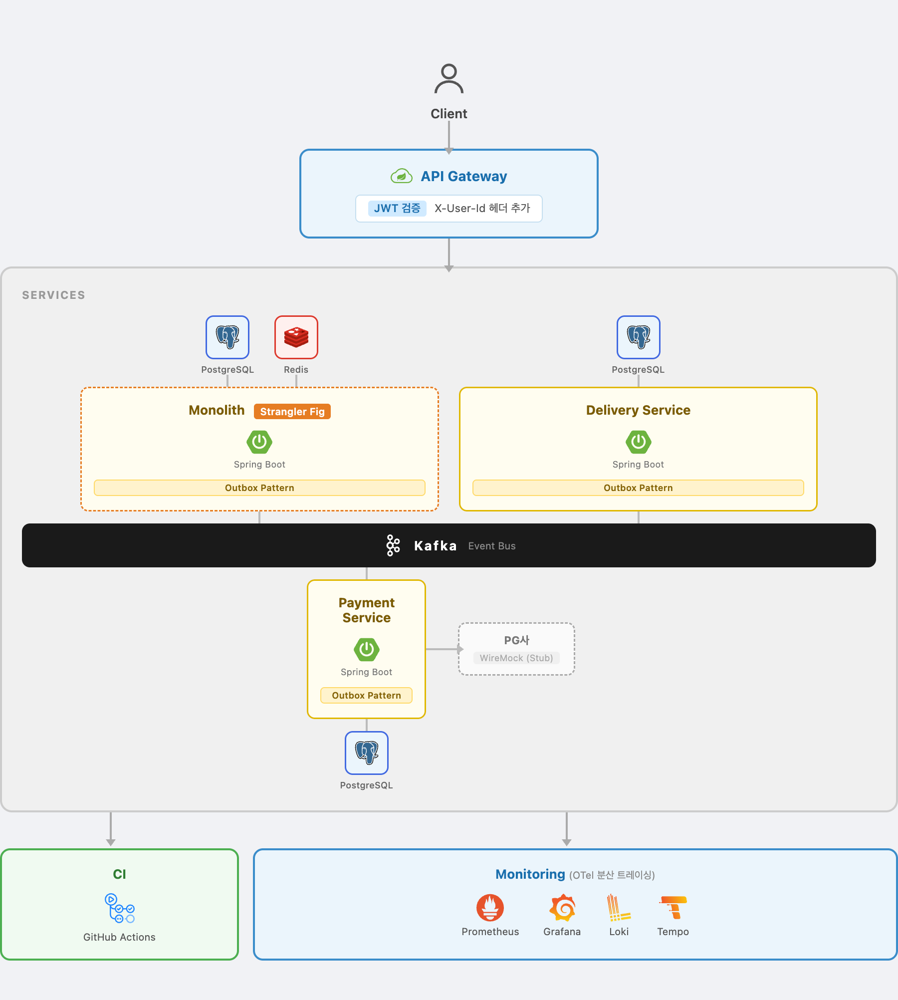

# PlayGround Project

> 아키텍처의 점진적 진화 과정을 기록하는 프로젝트

## 프로젝트 소개

`PlayGround`는 단순히 기능을 구현하는 것을 넘어, **아키텍처가 어떻게 진화하는지, 그 과정에서 개발자가 어떤 판단을 내리는지**를 데이터와 함께 기록하는 프로젝트입니다.

### 핵심 가치

- **가설 → 실험 → 측정 → 결론**: 모든 아키텍처 결정을 데이터로 뒷받침
- **의도적인 기술 부채**: 문제를 만들고, 식별하고, 해결하는 과정을 투명하게 공개
- **실패도 포함**: 분산 락 실험 → 성능 악화 → 대안 선택 등 시행착오 기록
- **성능 측정**: 각 Phase별 Before/After를 수치와 그래프로 증명

## 기술 스택

### Backend
- **언어**: Kotlin
- **프레임워크**: Spring Boot 3.5.X, Spring Cloud Gateway
- **데이터베이스**: PostgreSQL
- **캐시**: Redis
- **ORM**: Spring Data JPA
- **메시징**: Apache Kafka
- **보안**: Spring Security, JWT
- **빌드**: Gradle (Kotlin DSL, Composite Build)

### 테스트 & 품질
- **테스트**: Kotest, JUnit5, Spring REST Docs
- **코드 커버리지**: JaCoCo
- **코드 스타일**: Ktlint

### 인프라 & 모니터링
- **컨테이너**: Docker
- **부하 테스트**: k6
- **메트릭**: Grafana + Prometheus
- **로그**: Loki
- **분산 추적**: OpenTelemetry + Grafana Tempo

## 아키텍처 다이어그램



## 아키텍처 로드맵

### V1.0: Single Module Layered Architecture
전통적인 계층형 아키텍처로 시작. **의도적 기술 부채**(Fat JPA Domain, Service 간 강한 결합)를 생성하여 문제를 식별하고 다음 단계의 동기를 확보.

### V1.5: Single Module Hexagonal Architecture
Ports & Adapters 패턴으로 **도메인 순수성 확보**. JPA Entity와 Domain Model 분리. 단일 모듈의 한계(도메인 간 순환 참조, 관례 기반 경계) 식별.

### V2.0: Multi Module Hexagonal Architecture
각 도메인을 독립 Gradle 모듈로 분리. **Contract Module**을 도입하여 도메인 경계를 컴파일 타임에 강제. 통합테스트 → 레이어별 단위테스트 전환.

### V2.5: High Performed Monolith
- Redis 재고 관리: **P95 93.7% 개선** (1.41s → 88.8ms), Connection Pool Pending 174 → 0
- 비동기 이벤트 처리: **P95 99.8% 개선** (16.4s → 13.8ms), 에러율 29% → 0%

### V3.0: Microservices Architecture (현재)
- V2.0 Contract Module로 정의한 서비스 경계를 그대로 MSA 분리 기준으로 활용
- batch consume 시도 → 도메인 특성 충돌로 폐기 → partition 증가(리틀의 법칙)로 처리량 해결
- Outbox 즉시발행+재발행 복잡도 제거 → 단순 폴링으로 수렴

## 각 버전 상세 문서

각 Phase별 상세한 아키텍처 결정, 문제 인식, 해결 과정은 아래 문서를 참고하세요:

- **[V1.0: Layered Monolith](./README-V1.md)**
- **[V1.5: Hexagonal Architecture](./README-V1.5.md)**
- **[V2.0: Multi Module Hexagonal Architecture](./README-V2.0.md)**
- **[V2.5: High Performed Monolith](./README-V2.5.md)**
- **[V3.0: Microservices Architecture](./README-V3.0.md)**

## 브랜치 구조

```
phase/1.0-single-layered-architecture          (V1.0)
phase/1.5-single-module-hexagonal-architecture (V1.5)
phase/2.0-multi-module-hexagonal-architecture  (V2.0)
phase/2.5-high-performed-monolith              (V2.5)
phase/3.0-micro-services-architecture          (V3.0, 현재)
```

각 브랜치는 해당 Phase의 완성된 코드를 포함합니다.

