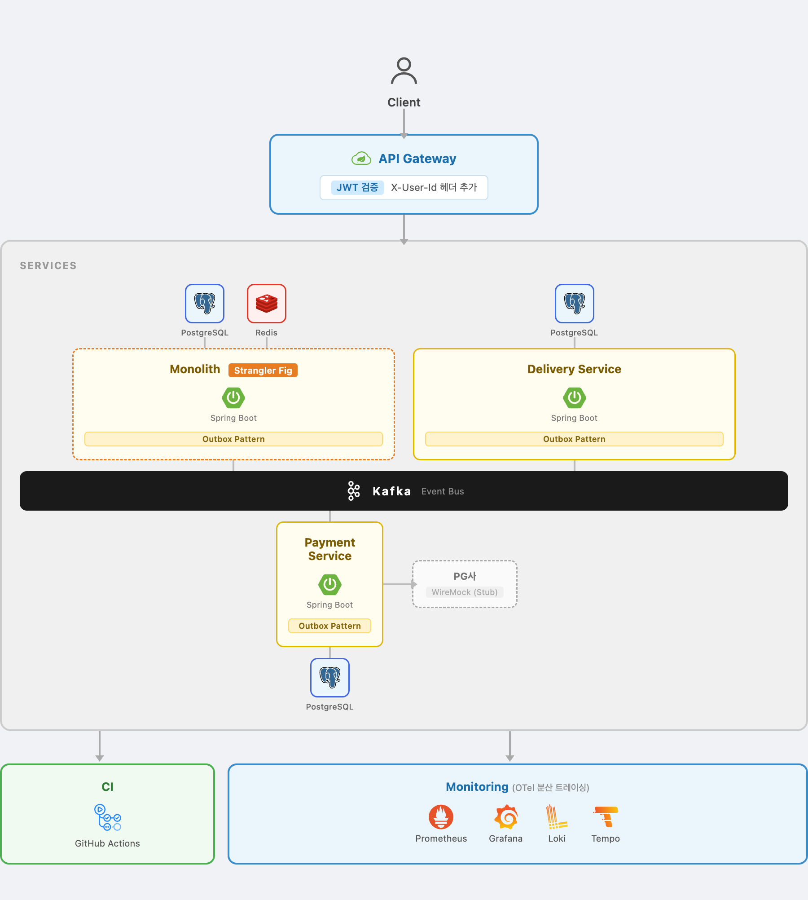

# ArchEvolve

> 아키텍처의 점진적 진화 과정을 기록하는 프로젝트

[Docker 실행 방법 ↓](#빠른-실행--docker-데모-v30)

## 프로젝트 소개

`ArchEvolve`는 단순히 기능을 구현하는 것을 넘어, **아키텍처가 어떻게 진화하는지, 그 과정에서 개발자가 어떤 판단을 내리는지**를 데이터와 함께 기록하는 프로젝트입니다.

### 핵심 가치

- **가설 → 실험 → 측정 → 결론**: 모든 아키텍처 결정을 데이터로 뒷받침
- **의도적인 기술 부채**: 문제를 만들고, 식별하고, 해결하는 과정을 투명하게 공개
- **실패도 포함**: 잘못된 가설, 시행착오도 그대로 기록
- **성능 측정**: 각 Phase별 Before/After를 수치와 그래프로 증명

## 기술 스택

### Backend
- **언어**: Kotlin
- **프레임워크**: Spring Boot 3.5.X, Spring Cloud Gateway
- **데이터베이스**: PostgreSQL
- **캐시**: Redis
- **ORM**: Spring Data JPA
- **메시징**: Apache Kafka
- **보안**: Spring Security, JWT
- **빌드**: Gradle (Kotlin DSL, Composite Build)

### 테스트 & 품질
- **테스트**: Kotest, JUnit5, Spring REST Docs
- **코드 커버리지**: JaCoCo
- **코드 스타일**: Ktlint

### 인프라 & 모니터링
- **컨테이너**: Docker
- **부하 테스트**: k6
- **메트릭**: Grafana + Prometheus
- **로그**: Loki
- **분산 추적**: OpenTelemetry + Grafana Tempo

## 아키텍처 다이어그램



## 아키텍처 로드맵

### V1.0: Single Module Layered Architecture
전통적인 계층형 아키텍처로 시작. **의도적 기술 부채**(Fat JPA Domain, Service 간 강한 결합)를 생성하여 문제를 식별하고 다음 단계의 동기를 확보.

### V1.5: Single Module Hexagonal Architecture
Ports & Adapters 패턴으로 **도메인 순수성 확보**. JPA Entity와 Domain Model 분리. 단일 모듈의 한계(도메인 간 순환 참조, 관례 기반 경계) 식별.

### V2.0: Multi Module Hexagonal Architecture
각 도메인을 독립 Gradle 모듈로 분리. **Contract Module**을 도입하여 도메인 경계를 컴파일 타임에 강제. 통합테스트 → 레이어별 단위테스트 전환.

### V2.5: High Performed Monolith
- Redis 재고 관리: **P95 93.7% 개선** (1.41s → 88.8ms), Connection Pool Pending 174 → 0
- 비동기 이벤트 처리: **P95 99.9% 개선** (16.4s → 13.8ms), 에러율 52.2% → 0%

### V3.0: Microservices Architecture (현재)
- V2.0 Contract Module로 정의한 서비스 경계를 그대로 MSA 분리 기준으로 활용
- batch consume 시도 → 도메인 특성 충돌로 폐기 → partition 증가(리틀의 법칙)로 처리량 해결
- Outbox 즉시발행+재발행 복잡도 제거 → 단순 폴링으로 수렴

## 각 버전 상세 문서

각 Phase별 상세한 아키텍처 결정, 문제 인식, 해결 과정은 아래 문서를 참고하세요:

- **[V1.0: Layered Monolith](./README-V1.md)**
- **[V1.5: Hexagonal Architecture](./README-V1.5.md)**
- **[V2.0: Multi Module Hexagonal Architecture](./README-V2.0.md)**
- **[V2.5: High Performed Monolith](./README-V2.5.md)**
- **[V3.0: Microservices Architecture](./README-V3.0.md)**

## 브랜치 구조

```
phase/1.0-single-layered-architecture          (V1.0)
phase/1.5-single-module-hexagonal-architecture (V1.5)
phase/2.0-multi-module-hexagonal-architecture  (V2.0)
phase/2.5-high-performed-monolith              (V2.5)
phase/3.0-micro-services-architecture          (V3.0, 현재)
```

각 브랜치는 해당 Phase의 완성된 코드를 포함합니다.

## 빠른 실행 — Docker 데모 (V3.0)

Docker Desktop(Linux containers)과 Docker Compose v2.20 이상만 있으면 실행할 수 있습니다. Java·Gradle·Python을 따로 설치하거나 IDE에서 앱을 실행할 필요는 없습니다. 최초 실행에는 이미지와 빌드 의존성을 내려받으므로 인터넷 연결이 필요합니다.

```bash
git clone --branch phase/3.0-micro-services-architecture https://github.com/SLCube/arch-evolve.git
cd arch-evolve
docker compose up --build -d --wait --wait-timeout 240
docker compose run --rm smoke-test
```

첫 명령은 애플리케이션 4개, PostgreSQL 3개, Redis, Kafka, WireMock을 실행하고 데모 데이터를 준비합니다. 마지막 명령은 **로그인 → 주문 → 모의 PG 결제 처리 → 배송 생성**을 확인합니다. 성공하면 `SMOKE TEST PASSED`가 출력됩니다. 실행할 때마다 데모 주문 1건과 관련 결제·배송 데이터가 추가됩니다.

| 항목 | 값 |
|---|---|
| API Gateway 상태 확인 | http://localhost:18080/actuator/health |
| API 명세 파일 | http://localhost:18080/docs/openapi3.yaml |
| 데모 로그인 ID / 비밀번호 | `demo-reviewer` / `demo1234` |
| 데모 데이터 ID 확인 | `docker compose logs demo-init` |

이 계정은 데모 상품 등록을 위해 관리자 권한을 갖습니다. 설정의 DB 비밀번호·JWT 키·PG 인증 값은 **공개된 로컬 데모 전용 값**이며 운영 환경에 사용하면 안 됩니다. 외부 PG 대신 WireMock을 사용하므로 실제 결제는 발생하지 않습니다. API 명세는 저장소에 포함된 파일이며 데모 이미지 빌드 시 재생성하지 않습니다. 명세의 서버 주소는 기존 로컬용 `8080`이므로 API 호출 시 데모 Gateway 주소 `http://localhost:18080`을 사용하세요.

데모는 `arch-evolve-demo`라는 별도 Compose 프로젝트와 전용 볼륨을 사용합니다. DB·Redis·Kafka와 개별 서비스 포트는 호스트에 공개하지 않으며, Gateway만 `127.0.0.1:18080`으로 공개합니다. 기존 IDE 실행 및 개발용 Compose 설정과 데이터는 그대로 유지됩니다.

### 실행 상태·로그·종료

```bash
docker compose ps -a
docker compose logs demo-init
docker compose logs --tail=100 monolith payment-service delivery-service
docker compose down
```

`kafka-init`과 `demo-init`이 `Exited (0)`인 것은 각각 토픽 준비와 데이터 초기화가 완료됐다는 뜻입니다. `demo-ready`는 초기화 완료 여부를 확인하는 작은 상태 확인 서버입니다. `down`은 데모 컨테이너와 네트워크만 제거하고 데이터 볼륨은 남깁니다.

초기화는 반복 실행해도 기존 데모 계정·상품·주소·기본 결제수단을 재사용합니다. 다음 명령으로 다시 실행할 수 있습니다.

```bash
docker compose run --rm demo-init
```

데모 데이터를 전부 지우고 처음부터 실행하려면 아래 명령을 사용합니다. **이 데모 프로젝트의 DB·Redis·Kafka 등 모든 볼륨 데이터가 삭제됩니다.** 기존 개발용 Compose 볼륨은 대상이 아닙니다.

```bash
docker compose down --volumes
docker compose up --build -d --wait --wait-timeout 240
```

### 모니터링도 함께 실행하려면

```bash
docker compose -f compose.yml -f compose.monitoring.yml up --build -d --wait --wait-timeout 240
docker compose -f compose.yml -f compose.monitoring.yml run --rm smoke-test
```

- Grafana: http://localhost:13000 (`admin` / `admin`)
- Prometheus: http://localhost:19090
- Grafana에서 Prometheus 메트릭, Loki 로그, Tempo 트레이스를 조회할 수 있습니다.
- 모니터링 구성을 사용했다면 종료할 때도 같은 두 파일을 지정합니다.

```bash
docker compose -f compose.yml -f compose.monitoring.yml down
```

### 실행 범위와 주의사항

- 현재 V3.0 브랜치의 실행 환경입니다. 과거 버전과 부하 실험은 기본 실행에 포함하지 않습니다.
- 데모 JVM 힙은 앱별 최대 512MB, DB 커넥션 풀은 서비스별 10개입니다. 과거 성능 실험의 실행 조건과 다릅니다.
- 정상 주문 흐름만 검증합니다. 중복 이벤트, PG 승인 후 저장 실패, 부분 실패 보상 등 장애 복구 전체를 검증하는 테스트는 아닙니다.
- 데모 계정은 가입 API로 만들고, 관리자 권한과 배송 주소만 초기화 스크립트에서 DB에 준비합니다. 현재 주소 조회의 inner join 때문에 주소가 없는 사용자의 첫 주소 등록 API가 실패하는 기존 문제가 있어, 이 데모에서는 미리 준비한 주소를 사용합니다. 상품·결제수단은 API로 생성합니다.
- 상품 생성 API는 Redis 재고를 초기화하지 않으므로 데모 초기화 작업이 누락된 재고 키를 준비합니다. 반복 초기화 시 기존 재고·예약·확정 수량은 덮어쓰지 않습니다.
- 재시작 시 앱의 기존 재고 캐시 초기화가 실행되므로, 주문 처리 중 재시작했을 때의 재고 정합성은 이 데모의 보장 범위가 아닙니다.
- 최초 빌드가 오래 걸릴 수 있습니다. `--wait-timeout`은 이미지 빌드 시간이 아닌 서비스 준비 대기 시간을 제한합니다.
- Docker에 CPU 4개·메모리 8GB 할당을 권장합니다. 이는 최소 사양을 검증한 값은 아닙니다. 메모리가 부족하면 Docker에 할당한 메모리를 늘리고 기본 구성부터 실행하세요.
- 포트 충돌이 발생하면 `compose.yml`의 호스트 포트 `18080`을 변경하세요. 모니터링 포트는 `compose.monitoring.yml`에서 변경합니다.
- 실행 실패 시 `docker compose ps -a`와 `docker compose logs --tail=100 <서비스명>`으로 확인합니다. 초기화 실패는 `docker compose logs demo-init`에서 확인합니다.

### 실행 환경 검증 기록 (2026-10-05)

Windows 11의 Docker Desktop Linux containers / Compose v5.5.1 환경에서 확인했습니다.

- 컨테이너 내부 JDK 21로 애플리케이션 4개 이미지 빌드 성공
- 별도 신규 볼륨에서 첫 실행과 주문·결제·배송 흐름 검증 성공
- 반복 초기화 후 데모 계정·상품·주소·결제수단이 각각 1개로 유지됨
- 전체 종료 후 데이터 볼륨을 유지한 재실행 성공 (빌드 캐시가 있는 환경에서 준비까지 약 60초)
- 모니터링 구성에서 앱 4개 Prometheus scrape `UP`, Loki 로그와 Tempo 트레이스 수집 확인
- 검증 스크립트의 정상 흐름·결제 실패·잘못된 배송·시간 초과·초기화 누락 단위 테스트 5개 통과

검증 스크립트 단위 테스트는 다음 명령으로 다시 실행할 수 있습니다.

```bash
docker compose run --rm --no-deps --entrypoint python smoke-test -m unittest -v test_demo
```

